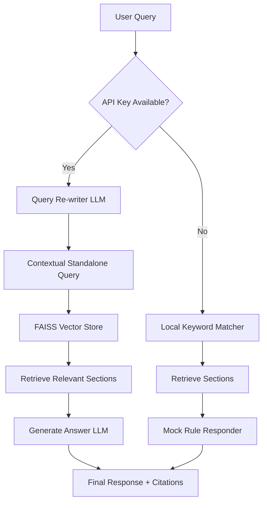

# Atmos Customer Support RAG Agent

A Retrieval-Augmented Generation (RAG) conversational customer support agent for **Atmos** (a fictional smart-home company), built using a custom **HTML5/CSS3/JavaScript frontend** and a lightweight **Python FastAPI backend**.

This application features **conversational memory** (with search query re-writing) and **source citations**, styled as a pixel-perfect, premium Pink & White WhatsApp Web clone.

---

## Architecture & System Flow



### Key Technical Details
* **Frontend UI/UX**: Custom HTML5, CSS3 transitions, sliding expansions, and responsive layout mirroring WhatsApp Web with speech tails, light pink user bubble backgrounds, and auto-focus scrolling.
* **Conversational Memory**: Stored in Python memory session logs. The query re-writer LLM (Groq `llama-3.1-8b-instant`) expands conversational shorthand (e.g. "How much does it cost to ship there?" -> "shipping cost to India").
* **Vector Store**: FAQ documents parsed and stored in a local **FAISS** index on CPU using a custom high-performance TF-IDF vector embeddings class with zero external dependencies.

---

## Local Setup & Execution

### Prerequisites
* Python 3.9 or higher installed.

### 1. Set up virtual environment
Open a terminal in the project directory:
```bash
# Create virtual environment
python3 -m venv .venv

# Activate virtual environment
source .venv/bin/activate  # On macOS/Linux
# .venv\Scripts\activate   # On Windows
```

### 2. Install dependencies
```bash
pip install -r requirements.txt fastapi uvicorn jinja2
```

### 3. Run the application
```bash
python app.py
```
This will start the FastAPI server at `http://localhost:8501`. Navigate to this URL in your browser to view the application.

---

## Free Cloud Deployment

For the first assignment, deploying the application is simple and free using one of the following methods:

### Method A: Hugging Face Spaces (Recommended)
Hugging Face Spaces provides a free cloud hosting service with Git-integrated Docker builds.

1. **Create Space**: Go to [Hugging Face Spaces](https://huggingface.co/spaces) and click **"Create new Space"**.
2. **Configuration**:
   * Name your Space (e.g., `atmos-support-rag`).
   * Select **Docker** as the SDK.
   * Choose the **Blank** template.
   * Choose the **Free CPU Basic** hardware tier.
3. **Upload Code**: Clone the repository Hugging Face creates for you, paste the files (`app.py`, `atmos_faq.txt`, `requirements.txt`, `Dockerfile`, `static/`, `templates/`), commit, and push.
4. Hugging Face will read the `Dockerfile` and build/deploy your web app in under 2 minutes!

### Method B: Render.com (Web Services)
Render offers a free tier for deploying FastAPI Python web services.

1. **GitHub**: Push your project repository to GitHub.
2. **Render Account**: Connect your GitHub account to [Render.com](https://render.com/).
3. **Deploy Web Service**:
   * Click **"New +"** and select **"Web Service"**.
   * Link your repository.
   * Set the Start Command to: `python app.py`.
   * Set the Instance Type to **"Free"**.
4. Click **"Deploy Web Service"**. Render will host the application and provide a public URL!
